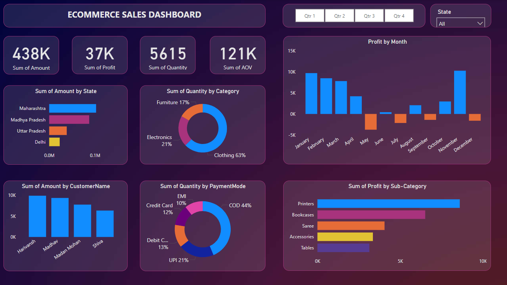

# Ecommerce-Sales-Dashboard
# Overview

This project involves analyzing e-commerce sales data and creating an interactive dashboard using Power BI. The dashboard provides insights into various aspects of sales performance and customer behavior.

# Features

- Data Analysis: Comprehensive analysis of e-commerce sales data, including key metrics and trends.

- Interactive Dashboard: Created using Power BI, featuring a user-friendly interface for exploring data.

- Drill-down Functionality: Implemented complex parameters to allow detailed exploration of specific data points.

# Customization:
- Filters and slicers for tailored data views.

- Customized visualizations to present data in meaningful ways.

# Data Manipulation:
- Connections and joins between multiple tables.

- Calculations for data transformation and analysis.

- User-driven Parameters: Enabled dynamic visualizations based on user-selected parameters.

# Dashboard Highlights:
- Sales Performance: Visual representation of sales trends over time, top-selling products, and revenue breakdowns.

- Customer Insights: Analysis of customer demographics, purchase behaviors, and segmentation.

- Product Analysis: Detailed views of product categories, inventory status, and sales by product.

# Technologies Used:
- Power BI: For data visualization and dashboard creation.

- Excel/CSV: For data storage and preprocessing.

- Data Manipulation Techniques: Including joins, calculations, and data transformation.

